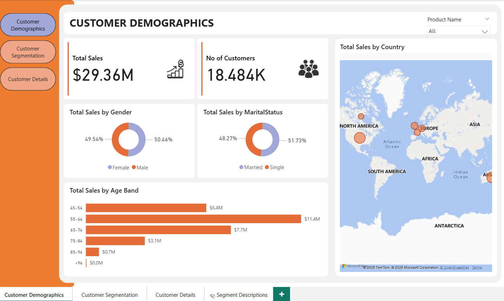

# 👥 Customer Segmentation (RFM Analysis) – Power BI Dashboard

## 📊 Project Overview

The **Customer Segmentation Dashboard** is an interactive Power BI project built to analyze customer behavior using **RFM (Recency, Frequency, Monetary)** analysis.
It provides business insights into customer demographics, segmentation, and purchasing behavior to help improve retention and target high-value customers effectively.

This dashboard empowers sales and marketing teams to identify loyal, at-risk, and new customers for better decision-making and customer relationship management.

---

## ✅ Screenshots

### **Dashboard Overview**

---

## 🚀 Key Features

### **1️⃣ Customer Demographics Page**

* Provides an overview of:

  * **Total Sales** and **Number of Customers**
  * **Sales by Gender**, **Marital Status**, and **Age Band**
  * **Sales Distribution by Country** (map view)
* Helps understand customer distribution across various demographic segments.

---

### **2️⃣ Customer Segmentation (RFM Analysis) Page**

* Performs **RFM segmentation** to classify customers into categories such as:

  * **Champions**, **Loyal**, **At Risk**, **Promising**, **New Customers**, etc.
* Includes visuals like:

  * **No. of Customers & Total Sales by Segment**
  * **Recency**, **Frequency**, and **Monetary Value** by Segment
* Enables identification of **high-value and at-risk** customers.

---

### **3️⃣ Customer Details Page (Drill-through)**

* A **drill-through page** that provides customer-level transaction insights.
* Displays detailed information including:

  * Customer ID, Gender, Marital Status, Total Spend, and RFM Scores
* Supports in-depth analysis for **individual customer profiles**.

---

### **4️⃣ Segment Descriptions Page**

* Explains the **definition and behavior** of each RFM segment.
* Helps business users understand how each segment contributes to overall performance.
* Acts as a **reference guide** for interpreting the segmentation results.

---

## 🧠 Insights Gained

* Identify **top-performing customer segments** (e.g., Champions & Loyal Customers).
* Detect **inactive or at-risk** customer groups requiring re-engagement.
* Understand **sales patterns** across demographics like gender, age, and country.
* Build **targeted marketing strategies** based on customer value tiers.

---

## 🧩 Tools & Technologies Used

* **Power BI Desktop**
* **RFM (Recency, Frequency, Monetary) Analysis Logic**
* **DAX Calculations** for metrics and segmentation
* **Data Modeling:** Relationships and filters across demographic data
* **Visualizations:** KPI Cards, Donut Charts, Maps, Bar Charts, and Drill-through

---

## 📁 Project Pages Summary

| Page Name                 | Purpose                                           |
| ------------------------- | ------------------------------------------------- |
| **Customer Demographics** | Analyze customer profiles and global sales trends |
| **Customer Segmentation** | Classify customers based on RFM scoring           |
| **Customer Details**      | Drill-through for customer-level information      |
| **Segment Descriptions**  | Description and meaning of RFM segments           |

---

## ⚙️ Data Source

* Simulated **Customer Sales Dataset**
* Contains attributes like:

  * `Customer ID`, `Gender`, `Marital Status`, `Age`, `Country`, `Sales`, `Recency`, `Frequency`, and `Monetary` values

---

## 🔗 Connect with Me

👤 **Sayed Ibrahim M**
📎 [LinkedIn Profile](https://www.linkedin.com/in/sayed-ibrahim-m)
